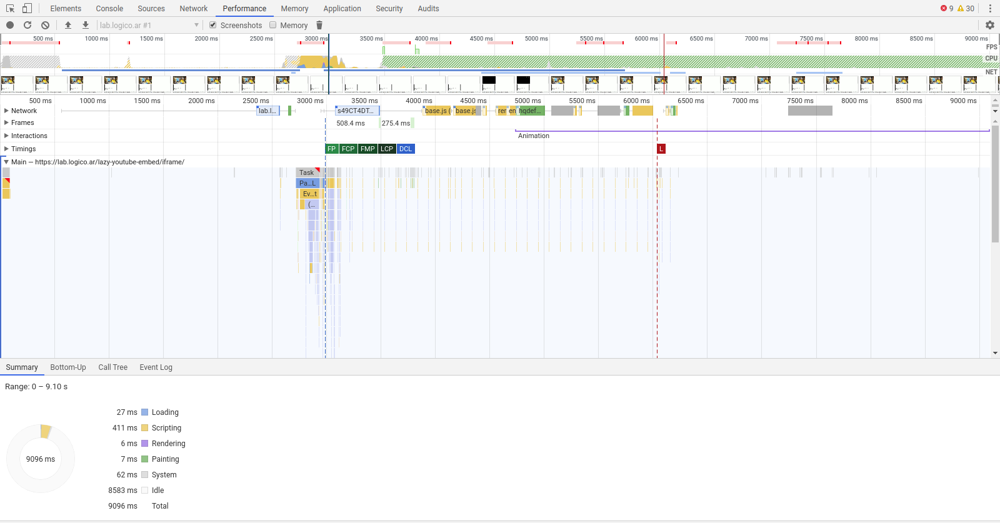
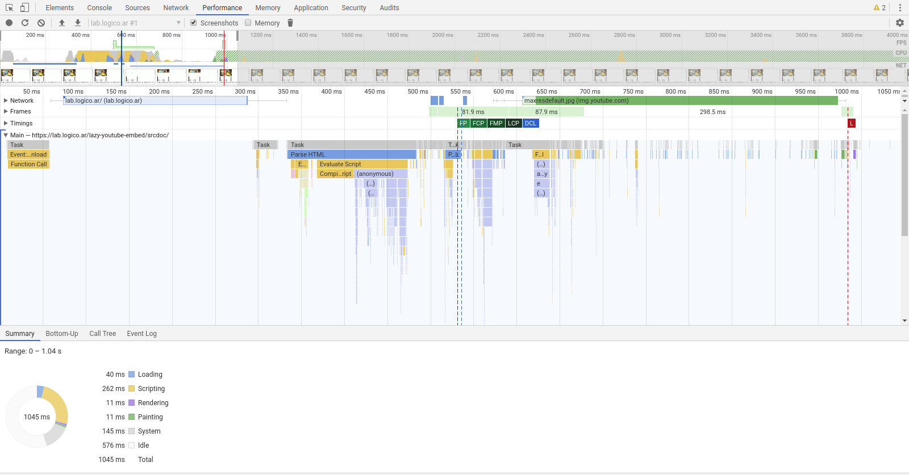

# lazy-youtube-embed
 

A fast, lightweight, lazy load, progressive enhancement YouTube embed. 🤯

- **NO DEPENDENCIES**.
- Graceful degradation: Uses the `a` tag instead `div` or custom element. Older or javascript disabled browsers can go to YouTube anyway.
- Lazy load: Load the video thumbnail using `IntersectionObserver API`.
- The quality of the thumbnail is decided using `Network Information API`.

## Install

```
$ npm install --save lazy-youtube-embed
```

Then with a module bundler like rollup or webpack, use as you would anything else:

```
// Using ES6 module
import lazyYoutubeEmbed from 'lazy-youtube-embed'
```

Or via CDN with script tag

```
<script type="text/javascript" src="https://cdn.jsdelivr.net/npm/lazy-youtube-embed@1.0.0/dist/lazy-youtube-embed.js" defer></script>
```

## Usage

In HTML add an `a` tag with the source to the YouTube video and `lazy-youtube-embed` class:

```
<a href="https://youtu.be/3vBwRfQbXkg" class="lazy-youtube-embed">HOW TO FUNK IN TWO MINUTES</a>
```

`lazy-youtube-embed` **must run after the DOM is loaded**.


## Comparison

These are 


Standard <iframe> YouTube embed.
[TEST IFRAME](https://lab.logico.ar/lazy-youtube-embed/iframe/)




Using `srcdoc` technique [css-tricks](https://css-tricks.com/lazy-load-embedded-youtube-videos/).
[TEST SRCDOC](https://lab.logico.ar/lazy-youtube-embed/srcdoc/)




Using `Lite YouTube Embed` [repo](https://github.com/paulirish/lite-youtube-embed).
[TEST LITE-YOUTUBE-EMBED](https://lab.logico.ar/lazy-youtube-embed/lite-youtube-embed/)


Using `Lazy YouTube Embed`.
[TEST LAZY-YOUTUBE-EMBED](https://lab.logico.ar/lazy-youtube-embed/lazy-youtube-embed/)

